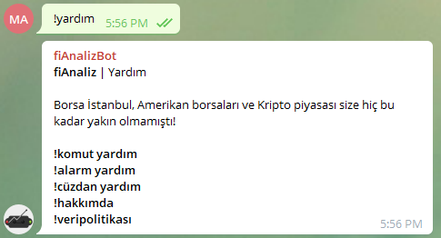
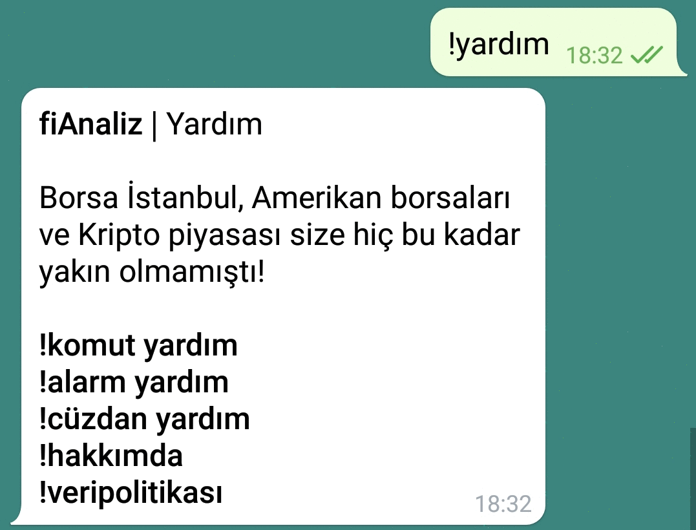

<br />
<p align="center">
  <a href="https://github.com/fiAnaliz/fiAnaliz">
    
  </a>

  <h3 align="center">fiAnaliz | Finans Botu</h3>

  <p align="center">
    Türkiye'nin ücretsiz borsa - kripto botu. Şimdi Whatsapp'ta, Telegram'da ve Discord'ta!
  <br />
    <a href="https://api.whatsapp.com/send/?phone=16053157748&text=!yardim">Whatsapp</a>
    ·
    <a href="https://t.me/fiAnalizBot">Telegram</a>
    ·
    <a href="https://discord.com/oauth2/authorize?client_id=844210790512984096&scope=bot&permissions=8">Discord</a>
  </p>
</p>
<p align="center">
<a href="https://twitter.com/intent/user?screen_name=fiAnaliz">Twitter'da takip et </a>
</p>

<details open="open">
  <summary><h2 style="display: inline-block">İçindekiler</h2></summary>
  <ol>
    <li>
      <a href="#fiAnaliz-hakkında">fiAnaliz Hakkında</a>,
      <ul>
        <li><a href="#veri-politikamız">Veri Politikamız</a></li>
      </ul>
    </li>
    <li>
      <a href="#kurulum">Kurulum</a>
      <ul>
        <li><a href="#sunucu-kurulumu">Sunucu Kurulumu</a></li>
          <ul>
            <li><a href="#öngereklililkler">Öngereklilikler</a></li>
            <li><a href="#veritabanı-kurulumu">Veritabanı Kurulumu</a></li>
            <li><a href="#sunucuyu-çalıştırma">Sunucuyu Çalıştırma</a></li>
          </ul>
        <li><a href="#client-kurulumu">Client Kurulumu</a></li>
            <ul>
            <li><a href="#öngereklilikler-1">Öngereklilikler</a></li>
            <li><a href="#clienti-çalıştırma">Client'i Çalıştırma</a></li>
          </ul>
      </ul>
    </li>  
      <a href="#kullanıma-başlarken">Kullanıma Başlarken</a>
      <ul>
        <li><a href="#whatsapp">Whatsapp</a></li>
        <li><a href="#telegram">Telegram</a></li>
        <li><a href="#discord">Discord</a></li>
      </ul>
    </li>
    <li><a href="#sistem-diyagramı">Sistem Diyagramı</a></li>
    <li><a href="#lisans">Lisans</a></li>
    <li><a href="#İletişim">İletişim</a></li>
  </ol>
</details>


# fiAnaliz Hakkında

fiAnaliz, birden fazla platform üzerinden senkron bir şekilde çalışabilir ve insanların ücretsiz bir şekilde finansal piyasalar hakkında bilgi edinmesini sağlar. fiAnaliz, Türkiye'de en fazla kullanıcıya sahip üç mesajlaşma ve haberleşme platformu üzerinden kişi kısıtlaması olmaksızın çalışabilmektedir.

## Veri Politikamız

fiAnaliz ekibi olarak kişisel gizlilik haklarınıza saygı duyuyor ve botlarımızı kullandığınız süre zarfında bunu sağlamak için çaba sarf ediyoruz. Kişisel bilgilerinizin güvenliği ile ilgili açıklamalar aşağıda açıklanmış ve bilginize sunulmuştur.

Mesajlar:
Mesajlarınız, gizliliğinize verdiğimiz önem sebebiyle kayıt altına alınmamakta ve üçüncü taraflarla paylaşılmamaktadır. Sadece ünlem işaretiyle (!) başlayan mesajlarınız veri tabanlarımızda AES 256 bit şifreleme ile arıza tespiti ve kullanım istatistikleri amacıyla saklanmaktadır.

Numaralarınız:
Numaralarınız cüzdan ve alarm sistemlerimizin kullanımı için veri tabanlarımızda AES 256 bit şifreleme ile saklanmaktadır. Veri tabanlarımız Türkiye sınırları içerisinde olup verileriniz yurt dışına çıkmamaktadır.

fiAnaliz ekibi verilerinizin güvenliği ve gizliliği için çalışmaktadır.

# Kurulum
## Sunucu Kurulumu
### Öngereklilikler:
* python3
* Flask
* PyMySQL
* requests
* Pandas
* mplfinance

### Veritabanı Oluşturma
```
git clone https://github.com/fiAnaliz/fiAnaliz.git
cd fiAnaliz/src
mysql -h server_adi -u kullanici_adi -p sifre fiAnaliz < mysql/configure_database.sql
```

### Sunucuyu Çalıştırma
Alarm fonksiyonunu kullanmak için alert_module ve backend_api_service'in çalışması gereklidir, grafik çizme ve cüzdan fonksiyonları da backend_api_service'e bağlıdır.
Bu iki koddaki Database sınıfının altındaki host, user, password ve db değişkenlerine veritabanını bilgilerinizle değiştirdikten sonra scriptleri iki ayrı terminalde çalıştırın.

```
python3 alert_module.py
python3 backend_api_service.py
```

## Client Kurulumu
### Öngereklilikler:
* Node.js
* Moment.js
* Express
* Discord.js (Discord için)
* node-telegram-bot-api (Telegram için)
* wa-automate-nodejs (Whatsapp için)

### Client'i Çalıştırma
```
node Whatsapp/main.js
node Discord/main.js
node Telegram/main.js
```

# Kullanıma Başlarken

fiAnaliz'i hangi platform üzerinden kullanmak istiyorsanız aşağıdaki davet linkleriyle kullanmaya başlayabilirsiniz.
<p align="center">
    <a href="https://api.whatsapp.com/send/?phone=16053157748&text=!yardim">Whatsapp</a>
    ·
    <a href="https://t.me/fiAnalizBot">Telegram</a>
    ·
    <a href="https://discord.com/oauth2/authorize?client_id=844210790512984096&scope=bot&permissions=8">Discord</a>
</p>

Özel mesaj ile veya botu eklediğiniz gruba !yardım yazarak kullanabileceğiniz komutları öğrenebilirsiniz.

<p align="center">
    
</p>

## Whatsapp

<p align="center">
  <a href="https://api.whatsapp.com/send/?phone=16053157748&text=!yardim">
    
  </a>
</p>

## Telegram

<p align="center">
  <a href="https://t.me/fiAnalizBot">
    
  </a>
</p>

## Discord

<p align="center">
  <a href="https://discord.com/oauth2/authorize?client_id=844210790512984096&scope=bot&permissions=8">
    
  </a>
</p>

# Sistem Diyagramı

<p align="center">
  
</p>

# Lisans

MIT Lisansı altında dağıtılmaktadır. Daha fazla bilgi için "LICENSE" bölümüne bakın.

# İletişim

İbrahim Enes Duran - İstanbul Teknik Üniversiesi - [LinkedIn](https://linkedin.com/in/ibrahimenesduran)\
Mesut Melih Akpınar - Boğaziçi Üniversitesi - [LinkedIn](https://www.linkedin.com/in/melihakpinar)  
