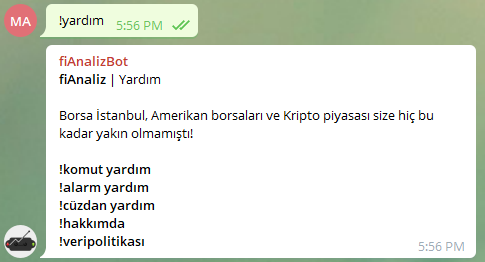
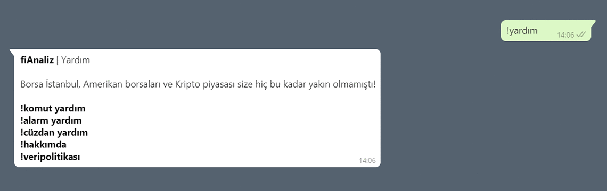
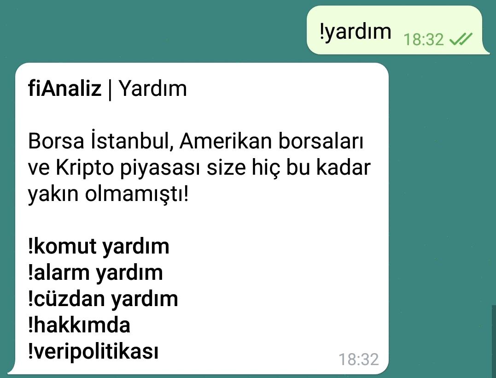
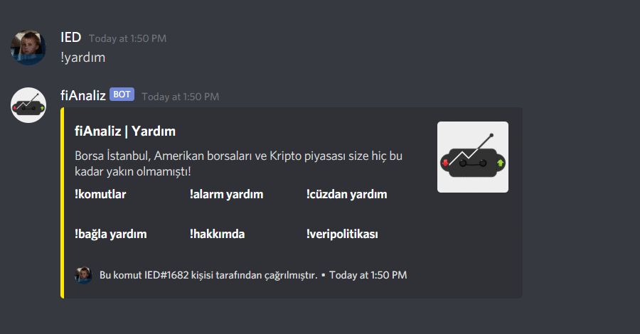

 

  

  <h3 align="center">fiAnaliz | Finans Botu</h3>

  

    Türkiye'nin ücretsiz borsa - kripto botu. Şimdi Whatsapp'ta, Telegram'da ve Discord'ta!
   
    <a href="https://api.whatsapp.com/send/?phone=16053157748&text=!yardim">Whatsapp</a>
    ·
    <a href="https://t.me/fiAnalizBot">Telegram</a>
    ·
    <a href="https://discord.com/oauth2/authorize?client_id=844210790512984096&scope=bot&permissions=8">Discord</a>
  

  
<h2 style="display: inline-block">İçindekiler</h2>

  <ol>
    <li>
      <a href="#fiAnaliz-hakkında">fiAnaliz Hakkında</a>,
      <ul>
        <li><a href="#veri-politikamız">Veri Politikamız</a></li>
      </ul>
    </li>
    <li>
      <a href="#kullanıma-başlarken">Kullanıma Başlarken</a>
      <ul>
        <li><a href="#whatsapp">Whatsapp</a></li>
        <li><a href="#telegram">Telegram</a></li>
        <li><a href="#discord">Discord</a></li>
      </ul>
    </li>
    <li><a href="#lisans">Lisans</a></li>
    <li><a href="#İletişim">İletişim</a></li>
  </ol>

## fiAnaliz Hakkında

fiAnaliz, birden fazla platform üzerinden senkron bir şekilde çalışabilir ve insanların ücretsiz bir şekilde finansal piyasalar hakkında bilgi edinmesini sağlar. fiAnaliz, Türkiye'de en fazla kullanıcıya sahip üç mesajlaşma ve haberleşme platformu üzerinden kişi kısıtlaması olmaksızın çalışabilmektedir.

### Veri Politikamız

fiAnaliz ekibi olarak kişisel gizlilik haklarınıza saygı duyuyor ve botlarımızı kullandığınız süre zarfında bunu sağlamak için çaba sarf ediyoruz. Kişisel bilgilerinizin güvenliği ile ilgili açıklamalar aşağıda açıklanmış ve bilginize sunulmuştur.

Mesajlar:
Mesajlarınız, gizliliğinize verdiğimiz önem sebebiyle kayıt altına alınmamakta ve üçüncü taraflarla paylaşılmamaktadır. Sadece ünlem işaretiyle (!) başlayan mesajlarınız veri tabanlarımızda AES 256 bit şifreleme ile arıza tespiti ve kullanım istatistikleri amacıyla saklanmaktadır.

Numaralarınız:
Numaralarınız cüzdan ve alarm sistemlerimizin kullanımı için veri tabanlarımızda AES 256 bit şifreleme ile saklanmaktadır. Veri tabanlarımız Türkiye sınırları içerisinde olup verileriniz yurt dışına çıkmamaktadır.

fiAnaliz ekibi verilerinizin güvenliği ve gizliliği için çalışmaktadır.

<a class="twitter-timeline" data-width="500" data-height="500" data-theme="dark" href="https://twitter.com/fiAnaliz?ref_src=twsrc%5Etfw">Tweets by fiAnaliz</a> 

## Kullanıma Başlarken

fiAnaliz'i hangi platform üzerinden kullanmak istiyorsanız aşağıdaki davet linkleriyle kullanmaya başlayabilirsiniz.

    <a href="https://api.whatsapp.com/send/?phone=16053157748&text=!yardim">Whatsapp</a>
    ·
    <a href="https://t.me/fiAnalizBot">Telegram</a>
    ·
    <a href="https://discord.com/oauth2/authorize?client_id=844210790512984096&scope=bot&permissions=8">Discord</a>

Özel mesaj ile veya botu eklediğiniz gruba !yardım yazarak kullanabileceğiniz komutları öğrenebilirsiniz.

    

### Whatsapp

  

### Telegram

  

### Discord

  

## Lisans

MIT Lisansı altında dağıtılmaktadır. Daha fazla bilgi için "LICENSE" bölümüne bakın.

## İletişim

İbrahim Enes Duran - İstanbul Teknik Üniversiesi - [LinkedIn](https://linkedin.com/in/ibrahimenesduran)\
Mesut Melih Akpınar - Boğaziçi Üniversitesi - [LinkedIn](https://www.linkedin.com/in/melihakpinar)  
